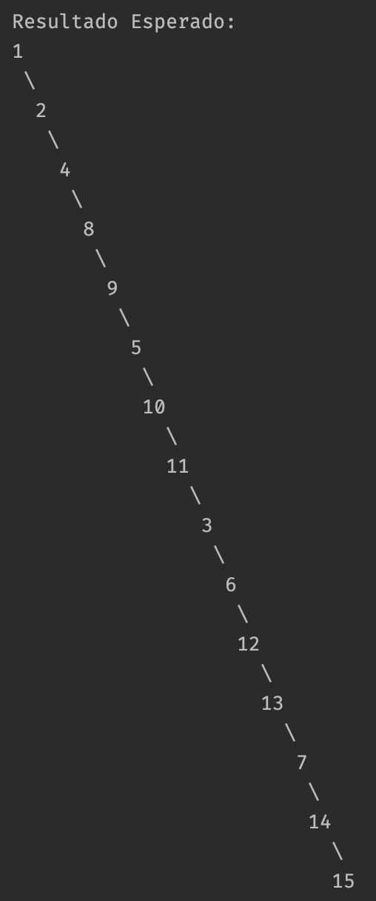

# Laboratorio 01

## Instrucciones

1. Para iniciar, debe crear un *Fork* del repositorio:


2. Vaya la pestaña de **actions** de su repositorio. Si ve un botón verde, haga clic en él para poder ejecutar las pruebas en el futuro.


3. Clone el nuevo repositorio en su computadora y ábralo en IntelliJ.

4. Construya/compile la aplicación en IntelliJ.

5. Ejecute las pruebas unitarias.

6. No se preocupe si todas o la mayoría de las pruebas fallan. Al terminar el examen, todas las pruebas deberían funcionar.
___

## Introducción

- Todos los ejercicios deben compilar para poder ser probados. Si por lo menos uno de los ejercicios no compila, la nota sera de **cero** puntos.
- Si el código original de un ejercicio no se modifica o la intención de su resolución no es clara, la nota del ejercicicio será de **cero puntos**, aún si hay pruebas que sí pasen para dicho ejercicio.
- NO agregue nuevos métodos `main()`, de lo contrario ninguna prueba podrá ejecutarse.
- NO cambie la firma de los métodos existentes (no agrege más parámetros ni cambie el nombre), estos son utilizados para probar su código.
- NO haga cambios en las pruebas, esto resulta en un **cero inmediato**.
- Puede agregar nuevas clases y/o archivos, como sea necesario.
- En la pestaña de **Actions** podrá ver como las pruebas se ejecutan con su código implementado (si hace `git push` de un nuevo commit).
___

## Ejercicio 1

Dado el nodo `root` de un árbol binario, aplane el árbol como una _"lista enlazada"_:
- La _"lista enlazada"_ debe utilizar la misma clase `TreeNode` donde el nodo `right` referencia al siguiente nodo en la lista y el nodo `
- La _"lista enlazada"_ debe tener el mismo orden que el **recorrido en preorder** del árbol binario.

### Ejemplo 1.1





```
root = [1,2,3,4,5,6,7,8,9,10,11,12,13,14,15]
resultado = [1,null,2,null,4,null,8,null,9,null,5,null,10,null,11,null,3,null,6,null,12,null,13,null,7,null,14,null,15]
```

### Ejemplo 1.2

```
root = []
resultado = []
```

### Ejemplo 1.3

```
root = [0]
resultado = [0]
```

### Restricciones

- La cantidad de nodos en el árbol se encuentra entre 0 y 200.
- Los valores de los nodos se encuentran entre 0 y 1000.